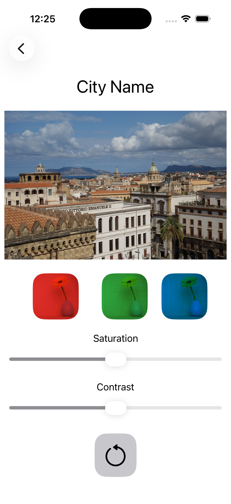
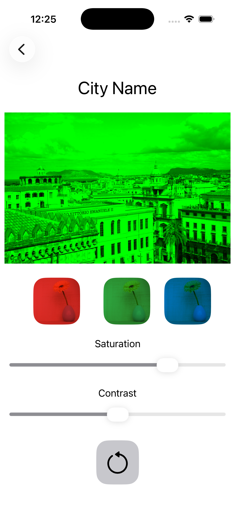

# 🎨 SwiftUI Image Editor App

A simple iOS app built with **SwiftUI** that allows users to modify an image using color filters, saturation, and contrast adjustments.

---

## 📱 Features

* Change image color using RGB multipliers (Red, Green, Blue)
* Adjust image saturation with a slider
* Adjust image contrast with a slider
* Reset all modifications to default values
* Simple and interactive UI built with SwiftUI

---

## 🛠️ Technologies Used

* Swift
* SwiftUI
* Xcode

---

## 🧠 What I Learned

* How to use `@State` in SwiftUI
* How to build interactive UI components (Buttons, Sliders)
* How to modify images dynamically in SwiftUI
* Basic state management and user interaction handling

---

## 📸 Preview

  
  

Example:

* Main screen with image controls
* Filtered image examples

---

## 🚀 How to Run the Project

1. Clone this repository
2. Open the project in Xcode
3. Select a simulator or a real device
4. Run the app

---

## 📌 Future Improvements

* Add preset filters
* Save edited images
* Improve UI animations
* Add dark mode support

---

## 👨‍💻 Author

Created by Giuseppe Cardinale

---

## 📄 License

This project is for learning purposes.
